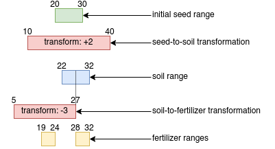

# AOC 2023, day 5

It's a series of transformations. You start with the seed (eg `79`), then you apply the transformation for the seed-to-soil map, if any (eg `+2` in the example), and so on until you get to `location`.

For the second part, you do the same, but you can't do it for individual seeds, since there are too many of them. What we need to do, is, as the statement says, treat input values as "range". This way, we have a very manageable set of ranges, and it's easy find the answer.

So, let's say you start with a seed range `[20,30]` and that the `seed-to-soil` map defines a transformation of `+2` over the range `[10,40]`. You original seed range is transformed to `[22,32]` since it is totally overlapped by the transformation range.

Your resulting range, which is the soil range is thus `[22,32]`.

Now imagine that your next map, the `soid-to-fertilizer` map, defines a transformation of `-3` over a range of `[5,27]`. This partially covers your `[22,32]` range, so it you will end up with **2 fertilizer ranges**:

- the section `[22,27]` of your soil range overlaps with the transformation, so it is transformed by `-3` and becomes `[19,24]`,
- the rest of your soil range, `[28,32]` is not affected by the `soil-to-fertilizer` transformation, so it stay unchanged: `[28,32]`.

You end up with 2 fertilizer ranges: `[19,24]` and `[28,32]`.

You feed each of these ranges to the next map transformations, until you reach the last one and you get all your location ranges. Then you just have to select the lowest start point. This is the answer.

Of course, you need to account for the fact that there are several transformations by map, and that these transformations can overlap, but it's not a big deal: you don't transform a range more than once in one map (hence the `transformed` property in my code).


## With a diagram

The example I just outlined can be represented with a diagram.

The input data are something like this:

```
seeds: 20 11

seed-to-soil map:
12 10 31

soil-to-fertilizer map:
2 5 23
```

Now the diagram:

